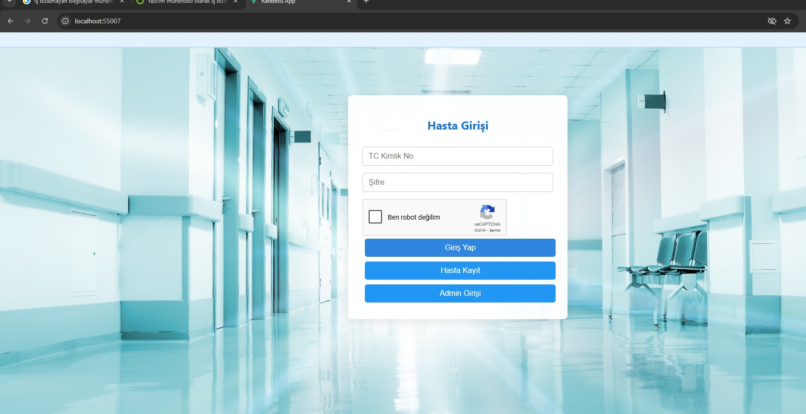
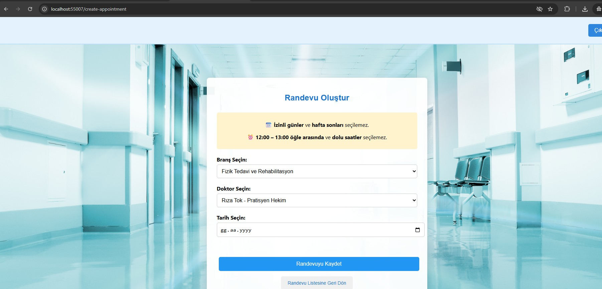
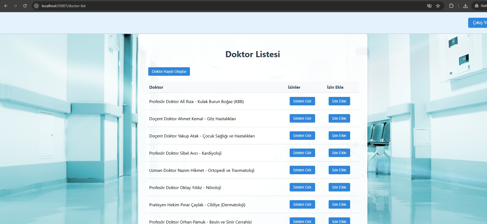
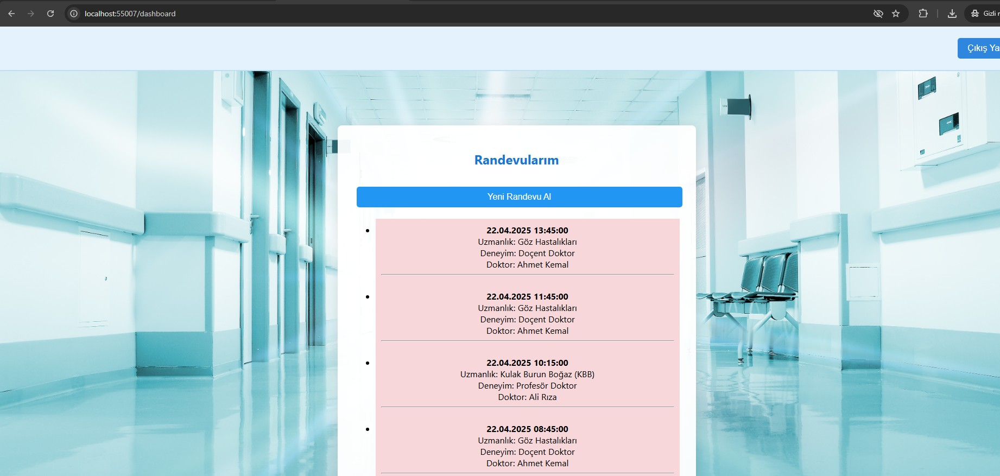

# Randevu Uygulaması

**Randevu**, kullanıcıların online randevu almasını ve yönetmesini sağlayan web tabanlı bir uygulamadır. Vue.js ile frontend, ASP.NET Core ile backend geliştirilmiştir.

---

## 🚀 Özellikler

- Kullanıcı kaydı ve giriş sistemi
- Randevu oluşturma, düzenleme ve iptal etme
- Yönetici paneli ile randevuları görme ve yönetme
- Responsive ve kullanıcı dostu arayüz
- reCAPTCHA ile bot koruması

---

## 📸 Ekran Görüntüleri

### Giriş Ekranı

### Randevu Formu

### Yönetici Paneli

### Randevu Listesi

